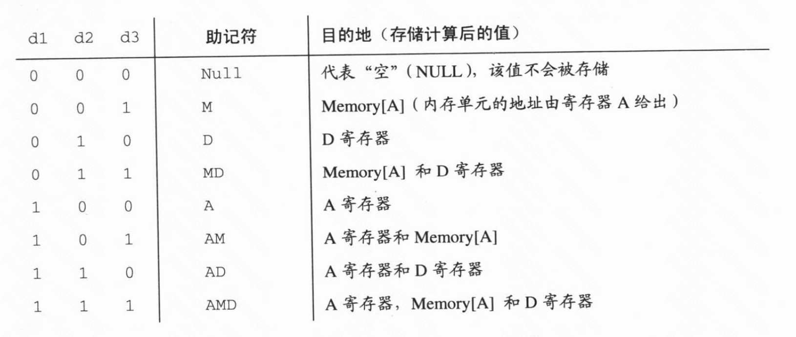
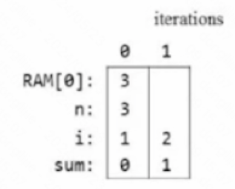
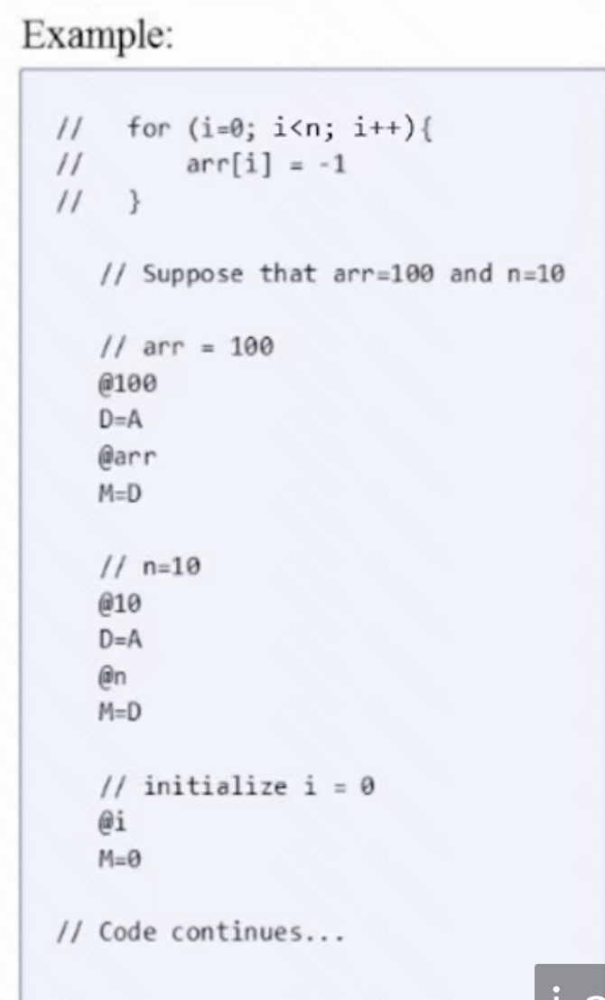

# 01布尔逻辑

> 这个模拟器不支持下划线。

什么是nand门？

就是与非门，所有的布尔函数都可以用与非门实现。


实现各种逻辑门。

在nand2tetris\tools目录下，HardwareSimulator.bat 运行硬件模拟器。另外，在projects目录下已经有对应的半成品文件，可以直接在那个基础上改，因为，它有测试脚本，在运行模拟器的时候，自动会加载测试脚本所在目录的hdl文件，所以直接在projects目录里改对应的内容就行了。


实现Not gate， Not.hdl

```
/**
 * Not gate:
 * out = not in
 */

CHIP Not {
    IN in;
    OUT out;

    PARTS:
    Nand(a=in, b=in, out=out);
}
```

实现And gate And.hdl

> ps： 我自己实现的和参考资料里给的不太一样。但是测试用例也是通过的。我看了参考资料里答案，它只不过是多用了一个nand门，思路和我是一样的。

```
/**
 * And gate: 
 * out = 1 if (a == 1 and b == 1)
 *       0 otherwise
 */

CHIP And {
    IN a, b;
    OUT out;

    PARTS:
    Nand(a=a, b=b, out=o1);
    Nand(a=o1, b=o1, out=out);
}
```

实现Or Gate

> 设计这个的时候，想了好多种方式都没有实现，最后先用了Not 门，最终才实现的。
>
> or = (not a) nand (not b)

```
// This file is part of www.nand2tetris.org
// and the book "The Elements of Computing Systems"
// by Nisan and Schocken, MIT Press.
// File name: projects/01/Or.hdl

 /**
 * Or gate:
 * out = 1 if (a == 1 or b == 1)
 *       0 otherwise
 */

CHIP Or {
    IN a, b;
    OUT out;

    PARTS:
    Nand(a=a,b=a, out=o1);
    Nand(a=b,b=b, out=o2);
    Nand(a=o1,b=o2, out=out);
}

```

Xor gate

> 我实现的时候，都是用的nand gate，实际上可以使用and not or 这些封装好的门代替。这样就会轻松一些
>
> xor = （a &（not b））Or（（not a） & b） 

```
// This file is part of www.nand2tetris.org
// and the book "The Elements of Computing Systems"
// by Nisan and Schocken, MIT Press.
// File name: projects/01/Xor.hdl

/**
 * Exclusive-or gate:
 * out = not (a == b)
 */

CHIP Xor {
    IN a, b;
    OUT out;

    PARTS:
    // Put your code here:
    // not gate
    Nand(a=a, b=a, out =nota);
    Nand(a=b, b=b, out =notb);
    //and gate
    Nand(a=a, b=notb, out =and1);
    Nand(a=and1,b=and1, out = o1);
    Nand(a=nota, b=b, out =and2);
    Nand(a=and2, b=and2, out =o2);


    // or gate
    Nand(a=o1,b=o1, out=o3);
    Nand(a=o2,b=o2, out=o4);
    Nand(a=o3,b=o4, out=out);

    

}
```

# 02 布尔运算

- 半加器：用来进行两位加法
  - LSB：[最低有效位](https://zh.wikipedia.org/wiki/%E6%9C%80%E4%BD%8E%E6%9C%89%E6%95%88%E4%BD%8D)，就是两位相加的和。
  - MSB：[最高有效位](https://zh.wikipedia.org/wiki/%E6%9C%80%E9%AB%98%E6%9C%89%E6%95%88%E4%BD%8D)，就是两位相加的进位。

- 全加器：用来进行三位加法
- 加法器：用来进行两个n位加法

增量器：用来对指定的数字加1

下图是基本门的真值表


## [实现半加器](https://developer.aliyun.com/article/593228)

下面这张图是半加法器的电路图，根据真值表，可以看出carrry，实际上就是A和B进行与运算。Sum就是A和B的异或。


## 实现全加器

通过计算，可以让a和b先进行相加，然后得到carry1和sum1，然后sum1和c再通过半加器，得到sum2和carry2，sum2就是最终的sum，而carry1和carry2再次相加得到的sum就是最终的carry，感觉这里面有某些规律，我还不太清楚。

我看了一下参考答案，求carry的时候，可以把最后的半加器换成异或门也是可以的，感觉这样使用的芯片更少。


实现ALU

```
这个看了答案，自己写不出来，可能是自己只看了书，没有看视频，有些东西还是记不得，比如像下面这样给b赋值，还有就是第一章的门电路没有熟练掌握
Add16(a = in, b[0] = true, b[1..15] = false, out = out);
```

# 03 时序逻辑

## 背景知识

触发器（Flip-Flops）：在计算机组成中，触发器是可以用来存储信息的电子单元（原理是啥我我暂时还不清楚），这里使用的触发器是数据触发器（DFF）。DFF能够将前一个时间周期的输入当作当前周期的输出。

**寄存器**：这里的寄存器和cpu里面的寄存器没有啥关系。它能够存储某一时刻的值，out(t)=out(t-1)


图里面用DFF实现寄存器的时候，还使用了mux 门，load就是sel，当前mux门的load为1的时候，把新值设置到in，这个时候寄存器就会存储新值。如果希望寄存器一直存储它的内部值等新的指令来，可以把load设置为0.**也就是说load为1，是对寄存器进行写操作，load为0是对寄存器进行读操作。**

**内存（RAM）**：可以把多个寄存器堆叠起来，寄存器实现了保存1比特位的机制，多个寄存器就可以实现多位寄存器，这个称之为字（word），多个字放在一起就组成了RAM。

**计数器**：是一种时序芯片，状态是整数，每经过一个时间周期，该整数就增加一个单位，执行函数out(t)=out(t-1) +c。

**时间问题**：


这里面提到了一个概念，叫“[数字竞争](https://www.cnblogs.com/kingstacker/p/7525764.html)”，就是信号的变化是需要时间的。**时序芯片包含的DFF保证了它们的输出变化仅仅发生在一个时钟周期到下一个时钟周期的转换点上，而不在时钟周期之内。**

## 规范概述

### D触发器（DFF gate）


DFF类似前两章的Nand。

### 寄存器


### 存储

RAM是由n个w位寄存器组成的阵列。配有直接访问电路，寄存器的个数(n)和每个寄存器的宽度(w)分别称为内存的尺寸(size)和宽度(width)，书里面开始构建RAM8、RAM64、RAM512、RAM4K、RAM16K。这些芯片的API是相同的。


### 计数器

比如指令计数器，它的内容是计算机下一时钟周期要读取和执行的指令地址，在大多数情况下，计数器在每个时钟周期内做简单的“加1”操作，因此计算机能够获取程序的下一条指令，有时候比如我们要跳跃的去执行编号为n的指令时，我们希望能将计数器设置为n，并且我们有时候，还希望能将计数器置0，让程序重新执行。


计数器的定义我觉得好复杂，不知道应该怎么设计，思路是怎么来的，看了答案以后，我想了一下，可能是这样来的。

```
/**
 * A 16-bit counter with load and reset control bits.
 * if      (reset[t] == 1) out[t+1] = 0
 * else if (load[t] == 1)  out[t+1] = in[t]
 * else if (inc[t] == 1)   out[t+1] = out[t] + 1  (integer addition)
 * else                    out[t+1] = out[t]
 */
 
 上面是计数器的功能说明
 
 首先，计数器用到了Register,但是这里，我并不确定in和load应该填啥。
 Register(in=?, load=?, out=pre-out,out=out);
 因为有一个加1的功能，所以，有一个Inc16的gate,输入是上一个时刻的out，
 Inc16(in=pre-out,out =add-out);
 下一时刻是否使用上一时刻的输出，还是增量器Inc16的输出，这里需要一个Mux16的门
 Mux16(a=pre-out,b=add-out,out=out-inc);
	然后是根据reset和load来选择值
 Mux16(a=?,b=false,load=reset, out=out-reset);// 根据reset选值
 Mux16(a=?,b=in,load=load, out=out-load);// 根据load选值
 
 所以这个时候，就可以列出来一个大概了
 Register(in=?, load=?, out=pre-out,out=out);
 Inc16(in=pre-out,out =add-out);
 Mux16(a=pre-out,b=add-out,out=out-inc);
  Mux16(a=?,b=false,load=reset, out=out-reset);// 根据reset选值
 Mux16(a=?,b=in,load=load, out=out-load);// 根据load选值
 这个时候，剩下了register、reset、load 这里面还没有选值。
 然后计数器的功能是resrt为1，那么下一时刻out 就为0，load 为1，下一时刻out就是in，否则就是另外一个值，这里我觉得在填的时候，要考虑优先级，reset的优先级要高于load，因为即使load，为1，先选了in，但是reset为1的话，还是要输出0，所以根据reset选值和根据load选值顺序就出来了。
  Mux16(a=out-load,b=false,load=reset, out=out-reset);// 根据reset选值
 Mux16(a=out-inc,b=in,load=load, out=out-load);// 根据load选值
 这个时候就只剩下register没有填值了
 Register(in=?, load=?, out=pre-out,out=out);
 Inc16(in=pre-out,out =add-out);
 Mux16(a=pre-out,b=add-out,out=out-inc);
  Mux16(a=out-load,b=false,load=reset, out=out-reset);// 根据reset选值
 Mux16(a=out-inc,b=in,load=load, out=out-load);// 根据load选值
 首先可以看得出来，经过Inc16和三个Mux16计算后，out和t就没有啥关系了。
 所以Register的in就是out-reset， load 一直为true。
 
 我觉得之前几章设计电路的时候，没有特别关注优先级，但是这里根据优先级就可以有思路了。不知道我想的对不对，等后面接着做题，再慢慢探索吧。
  
```


# 04 机器语言

## 背景知识

机器语言：可以被认为是一种特定的形式，利用处理器和寄存器来操作内存。

​	机器语言程序是一系列的编码指令，想要知道指令的意思，就必须要知道语言的规则。但是在实际编码中，它是有一系列的助记符的。可以用这些助记符进行编写程序，这些符号就是汇编语言，而将汇编程序翻译成二进制码的程序则称为汇编编译器。

内存：用来存储数据和指令的硬件设备。

CPU：是执行一组固定操作的基本设备。

寻址方式：

- 直接寻址：直接表示一个指定内存单元的地址，或者使用一个符号来表示这个指定的地址。比如：LOAD R1，67 // R1 <- Memory[67]

  LOAD R1，bar // R1 <- Memory[67]，这里假设bar指向内存地址67

- 立即寻址：加载常数，这种是直接将指令数据域中的内容当作要操作的数据装入寄存器，而不是将该数值当作内存单元的地址。

  LOADI R1，67 // R1<-67

- 间接寻址：操作指针那种。

## Hack机器语言规范

Hack是一个16位计算机，由一个CPU、两个独立的内存模块（指令内存和数据内存）以及两个内存映射I/O设备（显示器和键盘组成）。

内存地址空间：指令地址空间和数据地址空间，两个内存区都是16位宽，有15位地址空间，也就是说两个内存可设的最大地址都是32K的16-bit word（这里16位宽是指一个word 是16位这个跟计算机的位数有关，32K是寻址空间最大值，这个跟15位地址空间有关，2的15次方就是32k）

**cpu 仅能执行存储在指令内存中的程序**。指令内存是只读设备，一般存储在ROM里。

寄存器：Hack语言中主要有两个寄存器：A寄存器和D寄存器。D仅用来存储数据，而A既可以数据寄存器存储数据也可以是地址寄存器。由于指令的宽度是16位，对地址的描述要用到15位，所以就无法将操作码和地址放在同一条指令里，所以对某个地址执行操作之前，需要先将这个地址赋值给A寄存器。比如要执行D=M[516]-1，那就要先516这个地址赋值给A寄存器。

在Hack语言中，每个涉及内存地址的操作都需要两个命令，一个是用来确定将要进行操作的内存单元的地址，另一个是用来描述要进行的操作，分别对应地址指令（A指令）和计算指令（C指令）。

### **A指令**

从下面这张图可以看出来，左边第一位是0，表示这是A指令，


```
@10
D=A // 这里就是把常数10赋值给D寄存器 ，对应第一种用途

@2
D=M // 把RAM[2]的值 放到D寄存器上 对应第二种用途

@6  
0;JMP  // 这里就是跳转到第6行，add.asm示例代码，但是我实际上有一个疑问，一个程序如果有很多行，比如说有一万行，它一次如果加载不完的的，这个跳转是不是有问题。这个暂时还没有结论。后面继续学习再看吧


```


### **C指令**


也就是说C指令从左边起，前三位是固定的，就是111,接下来的7位表示是comp域，然后3位是dest域，最后3位是jump域。

#### **comp域**

​    在Hack中，ALU所执行的是一组固定的函数集，该函数集的功能实现了对寄存器D、A、M（M表示Memory[A]）的操作，计算函数指令的comp域由一个a位域（a-bits）和6个c位域（c-bits）组成。这7位可以对128个不同的函数进行编码。下图是其中的28个函数。


上面这张图是有点问题的，左边是a=0，右边是a=1，下面这张图是视频里的图。


​     比如让ALU计算D-1，对应的指令就是111**0 0011 10**00 0000，计算D|M就是1111 0101 0100 0000，计算常数-1，就是1110 1110 1000 0000

#### **dest域**

​    c指令comp域计算出来的结果，可以存储在不同的目的地址单元，具体的位置是由dest域的决定的，第一位和第二位分别决定是否将结果存入A或D，第三位决定是否将值存入M（比如Memory[A]）中。



如果期望将Memory[7]的值加1，并将结果也存到D寄存器。

```
0000 0000 0000 0111 // 这一行，把7存储到A寄存器中
1111 1101 1101 1000  // MD=M+1,这里，01 1 即11到13位表示计算结果存储到MD里， comp域 对应的是1 1101 11

```

#### **jump域**

告诉计算机下一步将执行什么命令，一种可能是计算机获取并执行程序中紧接着当前指令的下一条指令，另外一种可能是计算机获取并执行程序中位于其他地址的一条指令（这里假设A寄存器已经装载了跳转的目的地址）。

Jump操作能否实际执行取决于jump域的三个二进制位以及ALU的输出值。


三个jump位：分别代表含义，当第一jump位为1，且ALU输出值小于0，发生跳转，第二个jump位为1，ALU输出值等于0，发生跳转，第三个jump位为1，ALU输出值大于0，发生跳转。如上图，书上说的8种组合，实际上是这三的jump位的组合。

### **使用A寄存器的冲突**

由于可以使用A寄存器为“包含M的C指令”指定数据内存中的地址，也可以为“包含jump的C指令”指定内存中的地址，为了避免冲突，在可能引发jump（即有一些非零的jump位）的C指令中不能引用M，反之亦然（在“引用M的C指令”中也不准引发jump）

#### **符号**

汇编命令可以使用常数或符号表示内存单元地址，有以下三种方式应用到汇编语言中。

- 预定义符号：RAM地址的一个特殊子集可以通过如下预定义符号被汇编程序引用。
  - 虚拟寄存器：R0到R15 代表0到15号的RAM地址。
  - 预定义指针：符号SP、LCL、ARG、THIS、THAT被预定义为表示0到4号的RAM地址，它们等价于R0到R4。
  - I/O指针：符号SCREEN和KBD被预定义以表示RAM地址16384（0x4000）和24576（0x6000），这分别代表屏幕和键盘映像的基地址。

- 标签符号：用户自定义符号用来标记goto命令跳转的目的地址，由伪指令“（Xxx）”类声明用户自定的符号，其意义是：Xxx代表程序中下一条命令的指令内存位置，一个标签只能被定义一次，可以在汇编程序中的任何地方使用，即使是在其定义之前也可以使用。

- 变量符号：在汇编语言程序中用户定义的任何符号Xxx，如果它不是预定义符号，也不是标签符号，那么就被看作是变量，并被汇编程序赋予独立的内存地址（从RAM地址16即0x0010开始）.

> 在汇编语言中，标签和变量都是程序中所使用的符号。标签和变量的区别在于，标签是程序中的一个标记，用于标识某个位置或函数的入口，它通常不存储任何数据。而变量是在程序中所定义的一个数据单元，它会在程序执行期间占用内存空间，用于存储数据。
>
> 举个例子，假设我们要写一个汇编语言程序来计算数组中所有元素的和。那么我们可以定义一个数组变量用于存储数组元素，并使用一个循环来迭代数组中的每个元素，累加到一个结果变量中。在这个程序中，数组变量和结果变量都是变量，而循环开始和结束位置的标签则是用于标记程序的控制流程的位置。
>
> 所以标签可以在任何位置使用。


### **输入/输出处理**

Hack平台就两个外部设备，屏幕和键盘，两个设备与计算机平台的交互都是通过内存映像实现的，把数据写入到对应的内存地址，进行操作。

**屏幕**：黑白屏幕，256*512（131072）像素，屏幕内存是由RAM基地址为16384（0x4000）的8K内存映射来表示（这里用8K是因为，首先Hack计算机是16位的，8k就是8192，8192\*16就是131072）。物理屏幕的每一行从屏幕的左上角开始，在RAM中用32个连续的16位字表示（因为一行像素是512=32\*16），因此到顶部r行、到左边c列的像素映射到位置为RAM[16384+r\*32+c/16]（书上写的是16394这个是有问题的）的字。再到某个字里面具体哪一位就是c%16。对RAM内存映射的相关位进行读写操作（1=黑，0=白）

**键盘**：Hack计算机与物理键盘之间通过RAM基地址为24576（0x6000）的单字内存映像进行交互，只要在键盘上敲一个键，其对应的16位ASCII码值就出现在RAM[24576]，没有按键的时候，该内存单元的值就是0，除了常用的ASCII码之外，Hack键盘还可以识别下图中列出的一些键。


### **语法规约和文件格式**：

​    **二进制文件**由文本行组成，每行都是一连串的16个“0”和“1”ASCII字符，其对应一条单独的机器语言指令。文件中的所有行组成了机器语言程序，当机器语言程序被加载到计算机指令内存中，约定文件中的第n行所表示的二进制码被存储到指令内存地址为n的单元中（程序行数和内存地址计数都是从0开始），按照惯例，机器语言程序被存进扩展名为“hack”的文本文件中。

​    **汇编语言文件** 汇编语言程序存储在以“asm”为扩展名的文本文件里。文件中每一行代表一条指令或者一个符号定义。

​    **指令**一条A指令或C指令

​    **（Symbol）** 会让编译器把Symbol标签分配给程序中下一条命令被存储的内存单元地址。因为它不生成任何机器代码，所以被称为“伪命令”

下面是汇编语言的一些规约

**常数**和**符号** 常数必须是非负的而且总是用十进制表示，用户自定义的符号可以是任何字母、数字、下划线、点、美元符号、冒号构成的字符串，但不能以数字开头，

**注释**：以双斜线开头，就是单行注释

**空格**：空格字符以及空行也被程序忽略

**大小写**：所有的汇编助记符必须大写，其他的比如用户自定义标签（label）和变量名要区分大小写，一般是标签大写，变量名小写。


### **Hack 编程demo**


寄存器、内存

```
// 把数字10 存储到D寄存器中 D=10
@10
D=A // 这就是c指令， destination=comp;jump
// D++
D=D+1
// D=RAM[17]
@17
D=M
// RAM[17]=D
@17
M=D
//RAM[17]=10
@10
D=A
@17
M=D
// RAM[5]=RAM[3]
@3
D=M
@5
M=D

```


#### Add2.asm


运行cpu模拟器


使用预定义符号提高可读性

```
//RAM[5] =15
@15
D=A

@5
M=D

// 0～15 对应R0～R15

@15
D=A

@R5
M=D
```

#### 分支

分支、变量、迭代示例代码

```
Example：
// Program:Signum.asm
// Comutes:if R0>0
//							 R1=1
//							else
//								R1=0
@R0 //0
D=M // D=RAM[0]

@8
D;JGT // If R0>0 goto 8 D 在这里就是comp域的计算指令，这里是让ALU输出D中的值，然后执行jump

@R1
M=0 //RAM[1]=0
@10
0;JMP // end of program

@R1
M=1 // R1=1

@10
0;JMP

 

```


上面的代码，可读性不强，所以便加上了符号引用

```
Example：
// Program:Signum.asm
// Comutes:if R0>0
//							 R1=1
//							else
//								R1=0
@R0 //0
D=M // D=RAM[0]

@POSITIVE
D;JGT // If R0>0 goto 8 D 在这里就是comp域的计算指令，这里是让ALU输出D中的值，然后执行jump

@R1
M=0 //RAM[1]=0
@10
0;JMP // end of program
(POSITIVE) //这里声明了一个符号引用
@R1
M=1 // R1=1

@10
0;JMP
```


定义了一个label以后，在使用的时候，@label，编译器会将@label翻译成指定的行号n（就是标签声明之后的指令号，也就是说定义标签，并不占用行号，这句话不太合理，暂且先这样理解吧）。


注意：根据图示，标签的声明并没有被翻译，但是每个标签的引用都被替换了。

#### 变量


有两个原则：

​	1、一个引用，如果没有对应的标签声明，那就认为是变量

​	2、变量从RAM[16]开始分配地址


比如上面这段程序，在模拟器里执行的时候，可以看到@temp 被替换成对应的RAM地址了。第2行@16 就是@temp

#### 迭代


先写一个伪代码，然后将其翻译成机器语言，


最佳实践：

1、先写伪代码

2、将其翻译成汇编语言

3、在纸上测试程序，使用追踪表。



#### 指针


这里给了一个例子，给数组赋值，在翻译成机器语言以后，实际上是没有数组这个概念的，这里假设arr的地址是100，n的值是10，那么在内存里，arr在第16的位置，它的值是100，n在17的位置，它的值是10，这里赋值的最终结果是从100～109内存单元的值都变成-1。




# 05 计算机体系结构

## 背景知识

### 冯诺伊曼结构


图中的内存是一个抽象概念，准确地来说应该是记忆设备，代表任何具有存储功能的设备或组件。

#### 内存

冯诺伊曼的内存中有两种类型的信息：数据项和程序指令，对这两种信息通常会采用不同的方式来处理，在某些计算机里，它们被分别存储到不同的内存区中（数据内存和指令内存）

#### 中央处理器

负责执行已经被加载到指令内存中的指令，这些指令告诉cpu去执行不同的运算，对内存进行读/写操作，以及根据条件跳转去执行程序中的其他指令，CPU通过三个主要的硬件来执行这些任务：ALU（算数逻辑单元）、寄存器、控制单元

ALU： 主要用来执行算数操作和逻辑就操作（加减乘除与非等）

寄存器：用来加速，存储一些中间结果。

控制单元：负责控制 CPU 内部各部分的协调工作，包括控制 ALU 进行何种运算和何时进行运算等，它会先对执行进行解码，

#### 寄存器

有多种类型，

数据寄存器：用来存储一些临时的中间计算结果。

寻址寄存器：用于存储操作数相关地址。

程序计数寄存器：用来存储下一条指令的地址。

#### 输入/输出

输入输出设备有很多，不同设备的访问方式是不一样的。

IO映像指的是把计算机中的IO端口（Input/Output Ports）映射到内存空间中的一段地址范围内，使得程序可以通过读写内存地址的方式，来访问和控制这些IO设备

## Hack硬件平台规范详述

# 06 汇编编译器

## 背景知识

机器语言分为符号型和二进制型。符号化的语言称为汇编，翻译程序称为汇编编译器。

符号在汇编程序中的两个用途：

- 变量：程序员可以使用符号的变量名称，翻译器会自动的为其分配内存地址，但是这些地址的实际值是没有意义的，只要在程序的整个编译过程中，每个符号被始终指代为同一地址就可以了。
- 标签：可以用来标注不同的位置，用于循环跳转。

汇编编译器将符号翻译成二进制代码并不复杂，复杂的是将用户定义的变量名和符号标签与实际内存地址的映射。

比如瞎main这段代码，一共四个符号：2个变量，两个标签


这里先有两个假设：

1、翻译后的代码被存储到计算机中其实地址为0的内存中；

2、变量将会被分配到起始地址为1024的内存中。

接下来建立一个符号表，在源代码中，每遇到一个新符号xxx，就在符号表中添加一行（xxx，n）,n 就是分配给对应符号的内存地址。

## Hack 汇编到二进制的翻译规范详述

### 语法规约和文件格式

汇编代码使用asm后缀，机器码文件使用hack后缀，asm文件会被翻译同名的hack文件，比如Prog.asm文件，会被翻译成Prog.hack文件。

**二进制代码文件（.hack）文件**：由文本行组成，每一行由16个0/1组成。当机器语言程序被加载进计算机的指令内存时，文件的第n行二进制码被存储到地址为n的指令内存单元内（设程序命令行的计数和指令内存的起始地址都是从0开始）。

**汇编语言（.asm）文件**：由文本行组成，每一行代表一条指令或者一个符号声明。

- **指令**：A指令或者C指令。
- (symbol)：该命令并不产生机器代码，而是将symbol绑定到该程序中下一条命令的地址上，所以被称为伪命令。

**语法规定（仅适用于汇编程序）**

**常数(Constants)和符号(Symbols)：**常数必须是非负的，用十进制表示，用于定义的符号可以是由字母、数字、下画线、点、美元符号和冒号组成的字符序列，但是不能以数字开头。

**注释：**以两条斜线开头的文本行被认为是一条注释，注释不会被计算机执行。

**空格：**空格字符和空行被忽略。

**大小写习惯：**所有的汇编助记符必须大写，剩余的部分（用户自定义标号和变量名称）是区分大小写的，一般的习惯是，标签大写，变量名称小写。

### 指令

分为两种A指令和C指令。


### 符号


## 实现

这里提出一个基于4个模块的汇编编译器的实现：

- 语法分析器（Parser）模块：用来对输入文件进行语法分析

- 编码（Code）模块：用来提供所有汇编命令所对应的二进制代码

- 符号表（Symbol Table）模块：用来处理符号

- 主程序：用来驱动整个编译过程。


这里接下来使用高级语言实现。

### Parser模块


# 参考资料

[github参考项目](https://github.com/woai3c/nand2tetris)