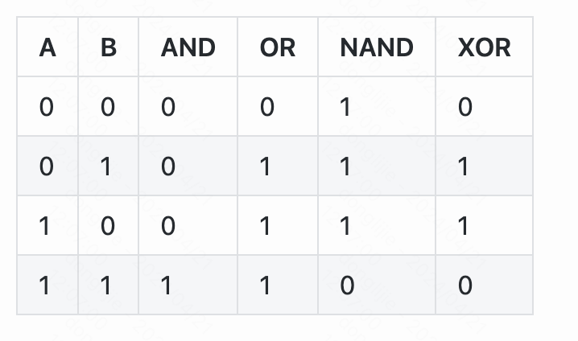

# 01布尔逻辑

什么是nand门？

就是与非门，所有的布尔函数都可以用与非门实现。


实现各种逻辑门。

在nand2tetris\tools目录下，HardwareSimulator.bat 运行硬件模拟器。另外，在projects目录下已经有对应的半成品文件，可以直接在那个基础上改，因为，它有测试脚本，在运行模拟器的时候，自动会加载测试脚本所在目录的hdl文件，所以直接在projects目录里改对应的内容就行了。


实现Not gate， Not.hdl

```
/**
 * Not gate:
 * out = not in
 */

CHIP Not {
    IN in;
    OUT out;

    PARTS:
    Nand(a=in, b=in, out=out);
}
```

实现And gate And.hdl

> ps： 我自己实现的和参考资料里给的不太一样。但是测试用例也是通过的。我看了参考资料里答案，它只不过是多用了一个nand门，思路和我是一样的。

```
/**
 * And gate: 
 * out = 1 if (a == 1 and b == 1)
 *       0 otherwise
 */

CHIP And {
    IN a, b;
    OUT out;

    PARTS:
    Nand(a=a, b=b, out=o1);
    Nand(a=o1, b=o1, out=out);
}
```

实现Or Gate

> 设计这个的时候，想了好多种方式都没有实现，最后先用了Not 门，最终才实现的。
>
> or = (not a) nand (not b)

```
// This file is part of www.nand2tetris.org
// and the book "The Elements of Computing Systems"
// by Nisan and Schocken, MIT Press.
// File name: projects/01/Or.hdl

 /**
 * Or gate:
 * out = 1 if (a == 1 or b == 1)
 *       0 otherwise
 */

CHIP Or {
    IN a, b;
    OUT out;

    PARTS:
    Nand(a=a,b=a, out=o1);
    Nand(a=b,b=b, out=o2);
    Nand(a=o1,b=o2, out=out);
}

```

Xor gate

> 我实现的时候，都是用的nand gate，实际上可以使用and not or 这些封装好的门代替。这样就会轻松一些
>
> xor = （a &（not b））Or（（not a） & b） 

```
// This file is part of www.nand2tetris.org
// and the book "The Elements of Computing Systems"
// by Nisan and Schocken, MIT Press.
// File name: projects/01/Xor.hdl

/**
 * Exclusive-or gate:
 * out = not (a == b)
 */

CHIP Xor {
    IN a, b;
    OUT out;

    PARTS:
    // Put your code here:
    // not gate
    Nand(a=a, b=a, out =nota);
    Nand(a=b, b=b, out =notb);
    //and gate
    Nand(a=a, b=notb, out =and1);
    Nand(a=and1,b=and1, out = o1);
    Nand(a=nota, b=b, out =and2);
    Nand(a=and2, b=and2, out =o2);


    // or gate
    Nand(a=o1,b=o1, out=o3);
    Nand(a=o2,b=o2, out=o4);
    Nand(a=o3,b=o4, out=out);

    

}
```

# 02 布尔运算

- 半加器：用来进行两位加法
  - LSB：[最低有效位](https://zh.wikipedia.org/wiki/%E6%9C%80%E4%BD%8E%E6%9C%89%E6%95%88%E4%BD%8D)，就是两位相加的和。
  - MSB：[最高有效位](https://zh.wikipedia.org/wiki/%E6%9C%80%E9%AB%98%E6%9C%89%E6%95%88%E4%BD%8D)，就是两位相加的进位。

- 全加器：用来进行三位加法
- 加法器：用来进行两个n位加法

增量器：用来对指定的数字加1

下图是基本门的真值表



## [实现半加器](https://developer.aliyun.com/article/593228)

下面这张图是半加法器的电路图，根据真值表，可以看出carrry，实际上就是A和B进行与运算。Sum就是A和B的异或。


## 实现全加器

通过计算，可以让a和b先进行相加，然后得到carry1和sum1，然后sum1和c再通过半加器，得到sum2和carry2，sum2就是最终的sum，而carry1和carry2再次相加得到的sum就是最终的carry，感觉这里面有某些规律，我还不太清楚。

我看了一下参考答案，求carry的时候，可以把最后的半加器换成异或门也是可以的，感觉这样使用的芯片更少。


实现ALU

```
这个看了答案，自己写不出来，可能是自己只看了书，没有看视频，有些东西还是记不得，比如像下面这样给b赋值，还有就是第一章的门电路没有熟练掌握
Add16(a = in, b[0] = true, b[1..15] = false, out = out);
```


# 参考资料

[github参考项目](https://github.com/woai3c/nand2tetris)